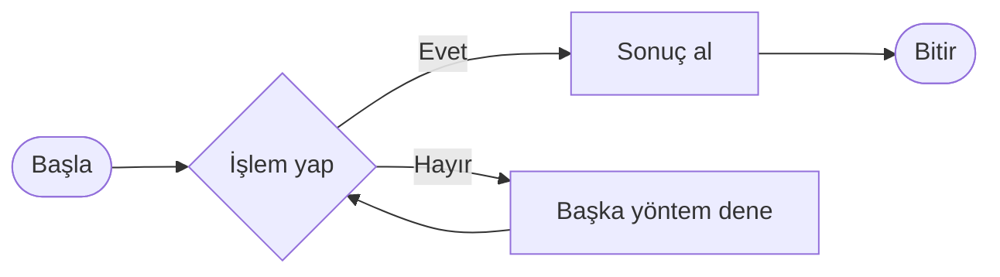
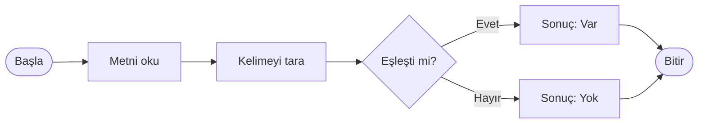
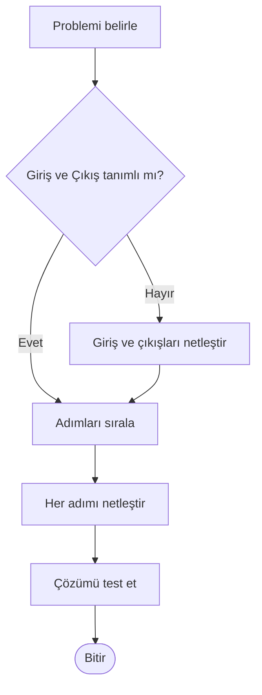
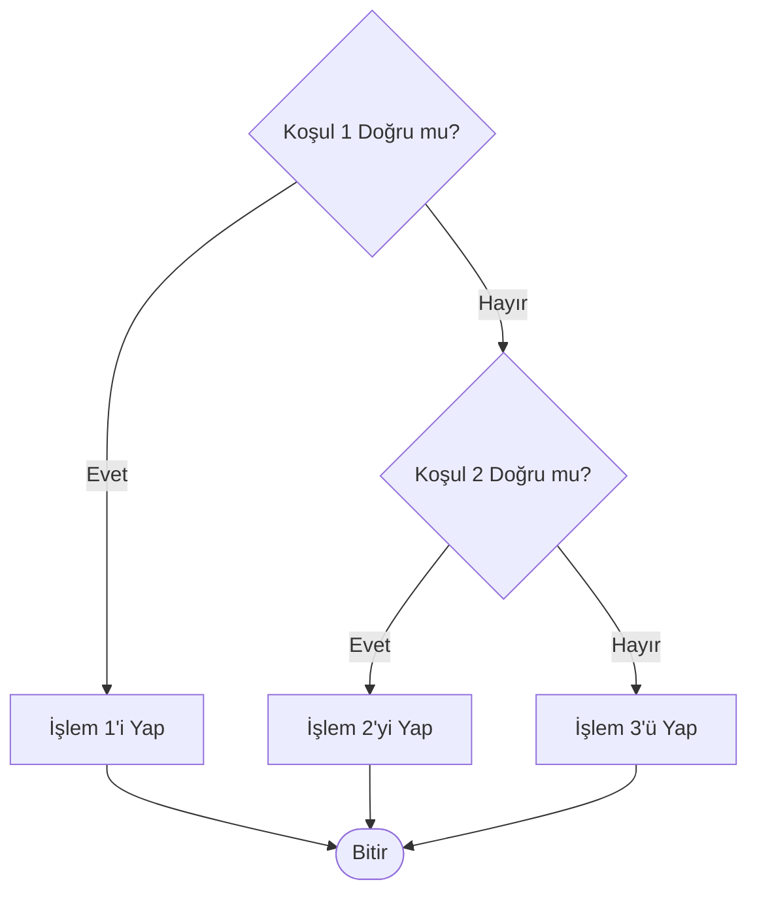
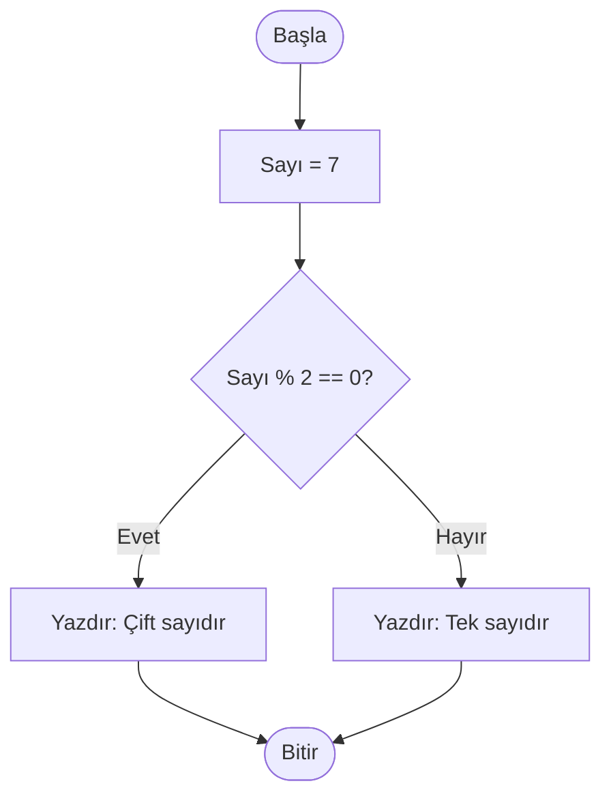
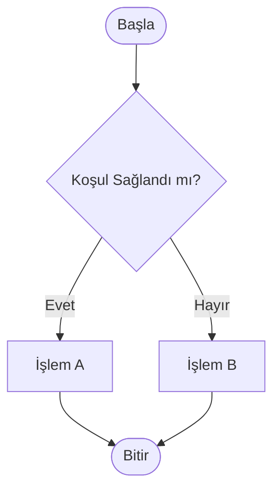
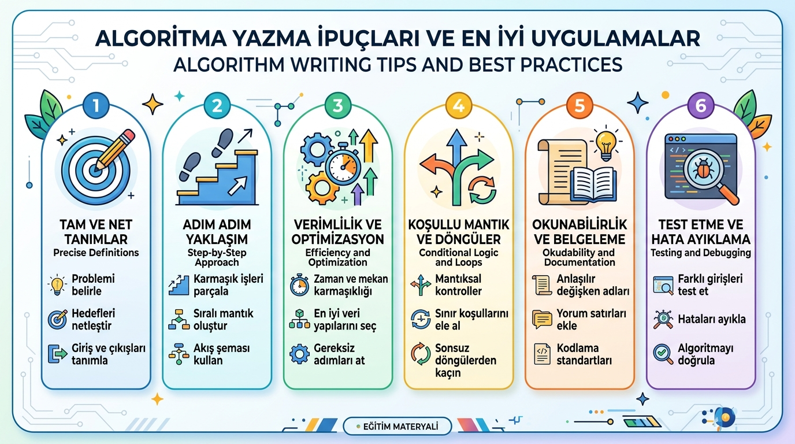

# Algoritma Nedir?

## Giriş: İşlem Yapmanın Felsefesi

Bilgisayarlar, temelinde sadece sayılar ve karakterler üzerinde işlem yapabilen sistemlerdir. Karmaşık işleri yerine getirebilmek için net, adım adım tanımlanmış talimatlara ihtiyaç duyarlar. **Algoritma**, bu işlem yapma sürecinin en temel ve en önemli yapı taşıdır.

> [!NOTE]
> Algoritma, bir yemek tarifine benzer: Malzemeler (**girdiler**), adımlar (**süreç**) ve hazırlanan yemek (**çıktı**) içerir.



---

## Algoritma Tanımı

> Evrensel Bir Kavram

Algoritma, **belirli bir problemi çözmek veya bir amaca ulaşmak için tasarlanan mantıksal ve sıralı adım dizisidir**. Her adım, kendinden önceki adımın sonucuna dayalı olarak yürütülür ve sonunda kesin bir çıktı üretir.

### Algoritmanın Beş Kritik Özelliği

| Özellik | Açıklama | Örnek |
|---------|----------|-------|
| **Giriş** | İşlem başlamadan önce dışarıdan alınan verilerdir (0 veya daha fazla). | Diş fırçalamak için su ve macun |
| **Çıkış** | Algoritmanın sonunda ulaşılan kesin sonuçtur (en az 1 çıktı). | Temizlenmiş dişler |
| **Belirlilik (Açıklık)** | Her adım net, belirsizlikten uzak ve tek bir anlama gelecek şekilde ifade edilmelidir. | “2 dakika fırçala” (Net) yerine “Biraz fırçala” (Belirsiz) |
| **Sonluluk** | Algoritma sonsuz döngüye girmeden, belirli sayıda adımdan sonra sonlanmalıdır. | Fırçalama işleminin 2 dakika sonra bitmesi |
| **Etkinlik (Uygulanabilirlik)** | Her adım temel ve uygulanabilir olmalı; kağıt-kalemle bile yürütülebilecek basitlikte tutulmalıdır. | Adımların mantıksal ve fiziksel olarak gerçekleştirilebilir olması |

> [!TIP]
> İyi bir algoritma, her adımını kesin ve ölçülebilir kılar; yoruma açık veya belirsiz nokta bırakmaz.

---

## Algoritma Örnekleri

### 1. Kahve Yapım Algoritması

1. Kahve makinesine yeterli miktarda su ekleyin.  
2. Filtre kağıdını koyun ve üzerine kahveyi ekleyin.  
3. Kahve makinesinin kapağını kapatın.  
4. Başlat düğmesine basın.  
5. Demleme işleminin tamamlanmasını bekleyin.  
6. Kahveyi bardağa dökün.  
7. **Eğer** şeker isteniyorsa **şeker ekleyin ve karıştırın**.  
8. Kahveyi servis edin.

> [!IMPORTANT]
> Her adım mantıksal bir sırada olmalıdır. Örneğin, makineye su ve kahve koymadan başlat düğmesine basılamaz.

### 2. YouTube’da Video Arama Algoritması

1. İnternet tarayıcısını açın.  
2. Adres çubuğuna `youtube.com` yazıp Enter'a basın.  
3. Arama çubuğuna izlemek istediğiniz videonun adını yazın.  
4. “Enter” tuşuna basın veya arama simgesine tıklayın.  
5. Listelenen sonuçlar arasından ilgili videoyu seçin.  
6. Videoyu başlatın.

---

## Neden Algoritma Çok Önemlidir? Üç Evrensel Soru

### Soru 1: “Bu İşlemi Hazır Bir Araç Yapmıyorsa Ne Yaparım?”

Algoritma, karşılaştığınız benzersiz bir problemin **adım adım çözüm yolunu** oluşturmanızı sağlar. Örneğin, “bir metnin içinde belirli bir kelimenin var olup olmadığını” kontrol etmek istediğinizi düşünün.

#### Adım Adım Çözüm:
1. Metni baştan itibaren okumaya başla.  
2. Her kelimeyi aranan kelime ile karşılaştır.  
3. Eşleşme bulunursa, “Kelime bulundu” sonucunu ver ve dur.  
4. Metnin sonuna kadar eşleşme bulunamazsa, “Kelime bulunamadı” sonucunu ver ve dur.

### Soru 2: “Bilgisayarı Etkin Kullanmak İçin Ne Gerekir?”

Bilgisayarlar kendi başlarına düşünemezler; sadece basit komutları yürütürler. **Algoritma**, bu basit komutları anlamlı bir düzen içinde bir araya getirerek karmaşık problemleri çözmemizi sağlar.

> [!WARNING]
> Algoritmaya gereksiz adımlar eklemek, programın yavaş çalışmasına ve mantık hatalarının artmasına neden olur.



### Soru 3: “Farklı Şekillerde Aynı İşlemi Yapabilir miyim?”

Evet! Bir problem birden fazla farklı algoritma ile çözülebilir. Örneğin, 100 sayı arasından en büyük sayıyı bulmak için:

- **Yöntem A**: Her sayıyı diğer tüm sayılarla tek tek karşılaştır. (Yüksek işlem maliyeti)
- **Yöntem B**: Sayıları küçükten büyüğe sırala ve en sondaki elemanı al. (Sıralama maliyeti eklenir)
- **Yöntem C**: Sadece tek bir `EnBüyük` değişkeni tut; listede ilerlerken karşılaştığın sayı mevcut değerden büyükse değişkeni güncelle. (En verimli yol)

Her üç yöntem de doğru sonucu verir ancak kaynak kullanımı ve hız açısından **Yöntem C** en iyisidir.

> [!CAUTION]
> Yanlış algoritma seçimi, büyük veri kümelerinde ciddi performans kayıplarına yol açabilir (Örn: $O(n^2)$ karmaşıklığı yerine $O(n \log n)$ veya $O(n)$ tercih edilmelidir).

---

## Algoritma Geliştirme Süreci

### Aşama 1: Problemi Tanımla

Öncelikle **tam olarak neyin çözülmek istendiğini** belirlemelisiniz:
- “Kullanıcı girişinde bir şifre kontrolü yap” tanımı yeterli mi?
- “Hatalı giriş sayısını 3 ile sınırla ve hesabı kilitleyin” gibi ek kurallar gerekiyor mu?

> [!NOTE]
> Probleme net bir tanım getirmek, geliştirme sürecindeki gereksiz adımları ve zaman kaybını önler.



### Aşama 2: Giriş ve Çıkışları Belirle

- **Giriş (Input)**: Algoritmanın çalışması için ihtiyaç duyduğu veriler nelerdir?
- **Çıkış (Output)**: Algoritmanın üretmesi beklenen sonuç nedir?

| Problemin Tanımı | Giriş (Input) | Çıkış (Output) |
|------------------|---------------|----------------|
| Ortalama Hesaplama | 3 adet sayı | Sayıların aritmetik ortalaması |
| Çift Sayı Kontrolü | 1 adet tam sayı | “Çift” veya “Tek” mesajı |
| Kitap Arama | Kitap adı / Yazar adı | Kitabın kütüphanedeki raf konumu |

> [!TIP]
> Girdi ve çıktıların baştan net tanımlanması, yazılan algoritmanın doğruluk testini kolaylaştırır.

### Aşama 3: Mantıksal Yapıyı Kur

Bu aşamada problemin çözüm adımları tasarlanır. Şartlı durumlar için genellikle “eğer... ise... aksi takdirde...” mantıksal kalıpları kullanılır.

> [!IMPORTANT]
> Kodlamaya geçmeden önce olası tüm senaryoları ve uç durumları (edge cases) hesaba kattığınızdan emin olun.



### Aşama 4: Sıralı Algoritmayı (Psödokod) Oluştur

Algoritma adımları düzensiz yazılmaz; her adım **açık, sıralı ve numaralandırılmış** olmalıdır.

#### Örnek: Bir Sayının Çift Olup Olmadığını Kontrol Etme

```text
1. Başla
2. Sayı değerini al (Örn: Sayı = 7)
3. Kalan = Sayı % 2 (Sayıyı 2'ye böl ve kalanı bul)
4. Eğer Kalan == 0 ise:
       Ekrana "Çift sayıdır" yazdır.
   Aksi takdirde:
       Ekrana "Tek sayıdır" yazdır.
5. Bitir
```

> [!TIP]
> Modülo operatörü (`%`), bir sayının başka bir sayıya bölümünden kalanı verir ve çift/tek kontrollerinde sıklıkla kullanılır.



---

## Algoritma Türleri

### 1. Doğrusal (Linear / Sequential) Algoritmalar

Her adımı sırasıyla, herhangi bir şart veya döngü içermeden yürütülen algoritmallardır.  
**Örnek**: İki sayıyı toplayıp sonucunu ekrana yazdıran işlem.

### 2. Koşullu / Karar (Decision-Based) Algoritmalar

Belirli şartlara göre akışın farklı yönlere ayrıldığı algoritmallardır.  
**Örnek**: Öğrencinin notuna göre “Geçti” veya “Kaldı” kararı verilmesi.

> [!NOTE]
> Akış şemalarında karar mekanizmaları genellikle baklava/eşkenar dörtgen (rhombus) sembolü ile gösterilir.



### 3. Döngüsel / Tekrarlı (Iterative) Algoritmalar

Belirli bir koşul sağlandığı sürece aynı adımları tekrarlayan algoritmallardır.  
**Örnek**: Bir sınıftaki 30 öğrencinin notlarını tek tek okuyup genel ortalamayı hesaplamak.

---

## Başarılı Bir Algoritma İçin İpuçları

- **Netlik:** Tüm adımlar kesin ve anlaşılır olmalıdır.
- **Standart İfadeler:** Belirsiz bağlaçlar yerine “ise”, “değilse / aksi takdirde”, “olduğu sürece” gibi net deyimler kullanın.
- **Somutlaştırma:** Mantığı daha kolay doğrulamak için algoritmanızı örnek verilerle (izleme tablosu kullanarak) test edin.

> [!TIP]
> Akış şeması çizerken sembollerin içine uzun paragraflar yerine kısa ve öz ifadeler yazın; bu sayede diyagramın okunabilirliği artar.



---

## Sık Karşılaşılan Hatalar ve Çözüm Yolları

| Hata | Neden Kaynaklanır? | Çözüm Yolu |
|------|-------------------|------------|
| **Adım Eksikliği** | Süreçteki kritik bir mantık adımının unutulması. | Mantıksal akışı baştan sona kontrol listesiyle doğrulayın. |
| **Çelişkili Adımlar** | Birbiriyle çakışan veya aynı anda imkansız durumların tanımlanması. | Akış şeması çizerek adımların birbirini takip edebilirliğini inceleyin. |
| **Adım Belirsizliği** | “Biraz ekle”, “Yeterince bekle” gibi bağıl ifadelerin kullanılması. | Net sayılar, kesin ölçü birimleri ve limit değerler belirleyin. |
| **Sonsuz Döngü (Infinite Loop)** | Döngünün sonlanmasını sağlayan çıkış koşulunun tanımlanmaması. | Her döngüye mutlaka kontrol edilen ve değişen bir bitiş koşulu ekleyin. |

> [!WARNING]
> Sonsuz döngüler sistem kaynaklarını tüketerek yazılımın donmasına neden olur. Algoritmalarınızda her zaman bir durma koşulu bulunduğundan emin olun.

---

## Alıştırmalar

Aşağıdaki problemleri inceleyerek çözümlerinizi **önce adım adım (psödokod)** yazın, akış şeması konusunu öğrendikten sonra **akış şemasını** çizin.

### Alıştırma 1: Kahvaltı Alarmı

Gece yatmadan önce sabah uyanmak istediğiniz saati belirleyen ve alarm zamanını hesaplayan bir algoritma oluşturun.  
- **Giriş:** Şu anki saat ve yatılacak süre (saat/dakika).  
- **Çıkış:** Alarmın çalacağı saat.

### Alıştırma 2: Kitap Sayfası Sayma

Bir kütüphane veritabanında yer alan bir kitabın toplam sayfa sayısını doğrulamak ve belirli bir sayfanın varlığını aramak için izlenmesi gereken adımları yazın.

### Alıştırma 3: E-posta Şifresi Güncelleme

Kullanıcının e-posta şifresini güvenli bir şekilde değiştirmesini sağlayan adımları kurgulayın.  
Dikkate alınması gereken durumlar:
- Mevcut şifrenin doğrulanması.
- Yeni şifrenin belirlenen güvenlik kriterlerine (uzunluk, özel karakter vb.) uygunluğu.
- Yeni şifrenin eskisiyle aynı olmaması şartı.

> [!IMPORTANT]
> Şifre güncelleme adımlarında hatalı girilen durumlar için geriye dönme (tekrar deneme) akışını eklemeyi unutmayın.

---

## Özet

- **Algoritma**, bir problemi çözmek için tasarlanan mantıksal ve sıralı adım dizisidir.
- **5 temel özellik:** Giriş, Çıkış, Belirlilik, Sonluluk ve Etkinliktir.
- Günlük yaşamdaki rutin kararlarımızdan karmaşık yazılım sistemlerine kadar her süreç bir algoritmaya dayanır.
- Doğru tasarlanmış bir algoritma hatasız ve verimli sonuçlar verirken, hatalı bir algoritma yanlış sonuçlara veya performans kayıplarına yol açar.

> [!NOTE]
> Algoritma mantığını pekiştirmek için günlük hayatta yaptığınız işleri adım adım kağıda dökmeyi deneyebilirsiniz.