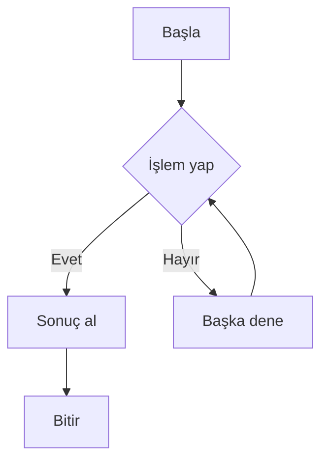
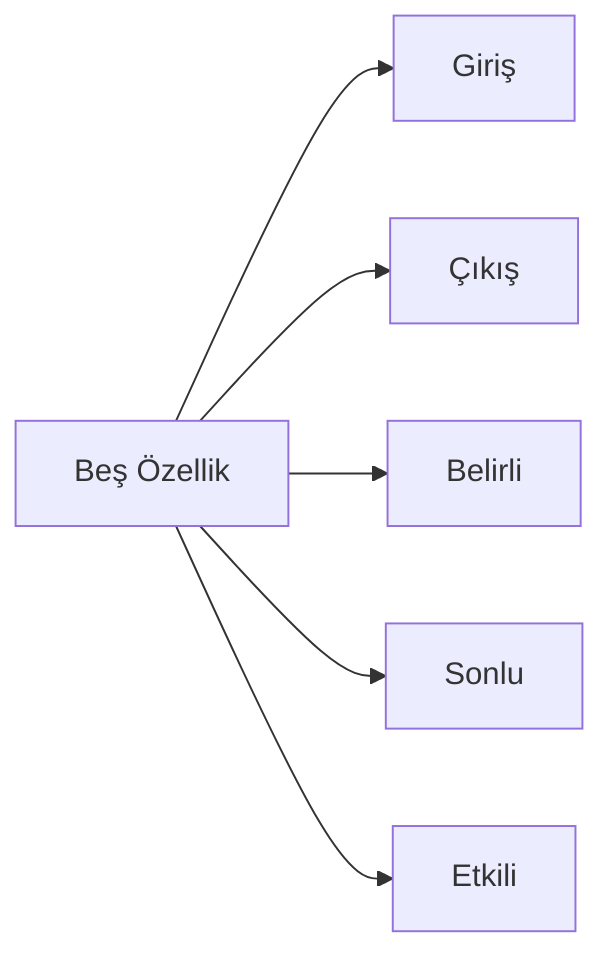
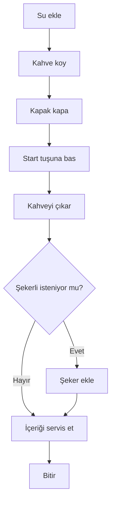
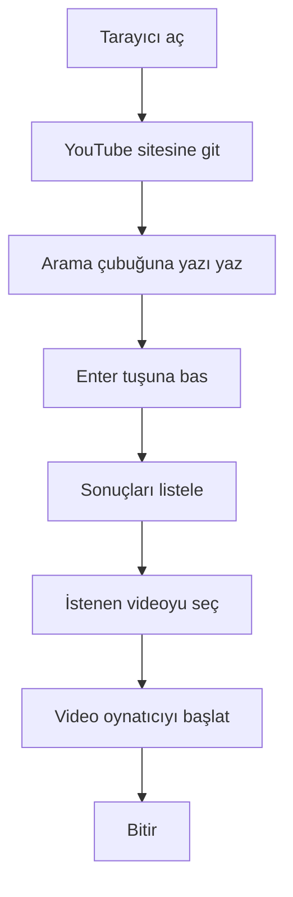
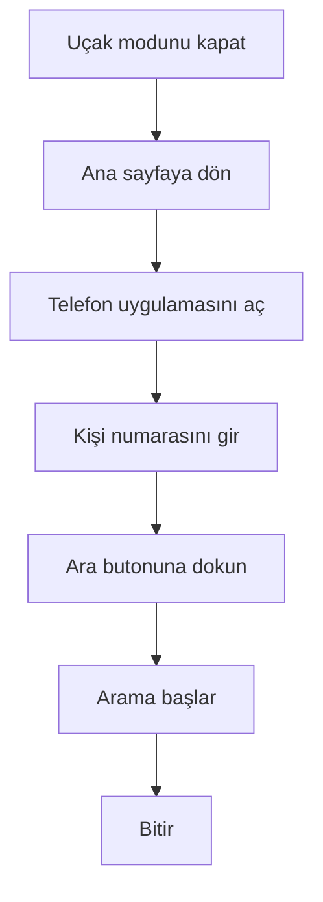
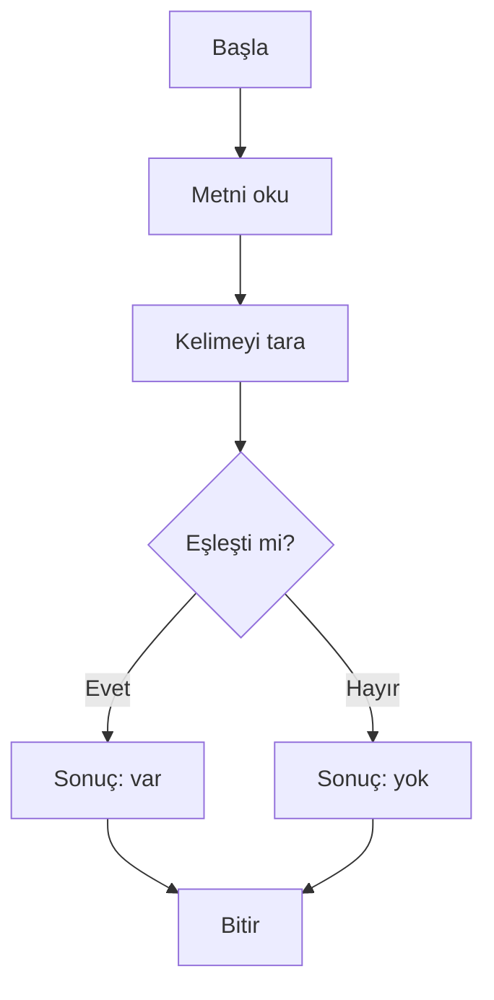
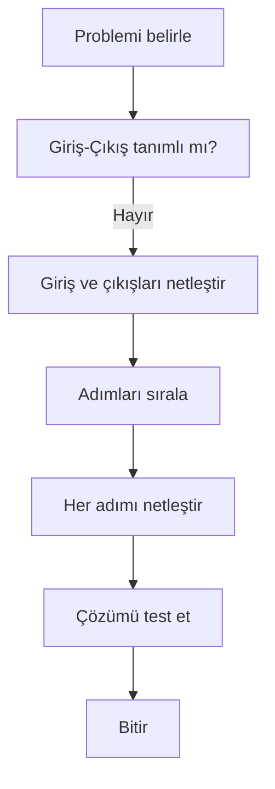
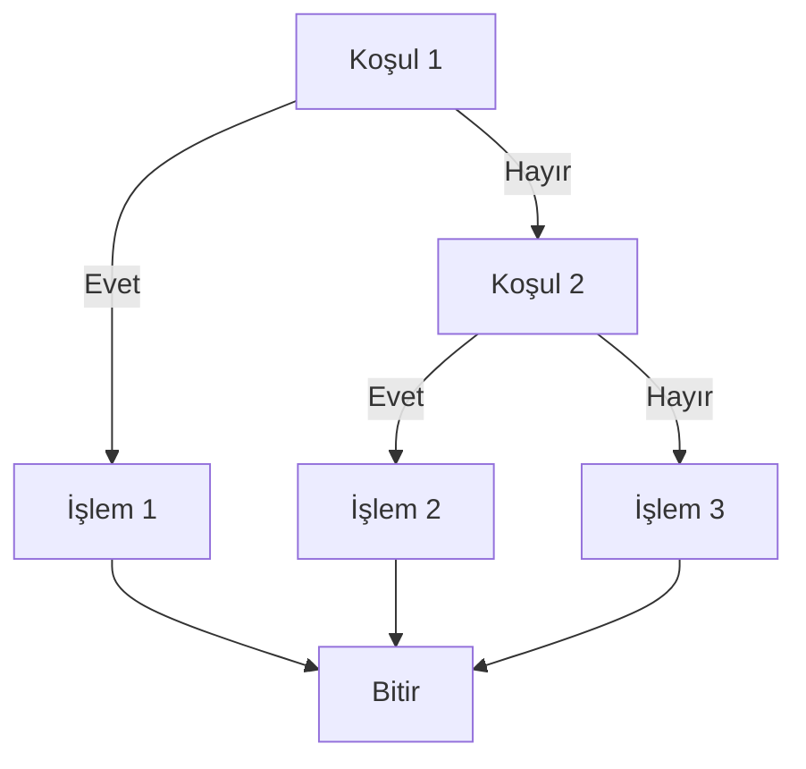
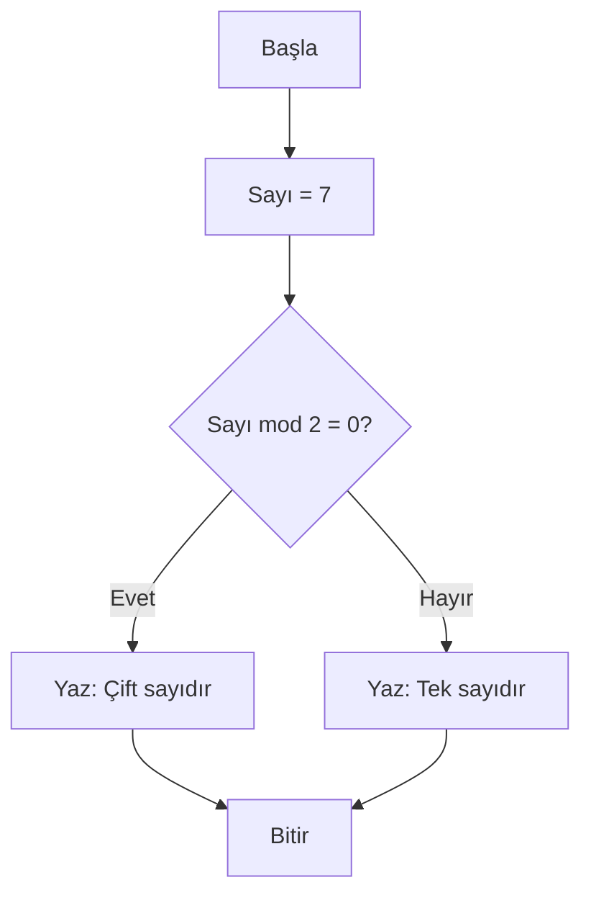
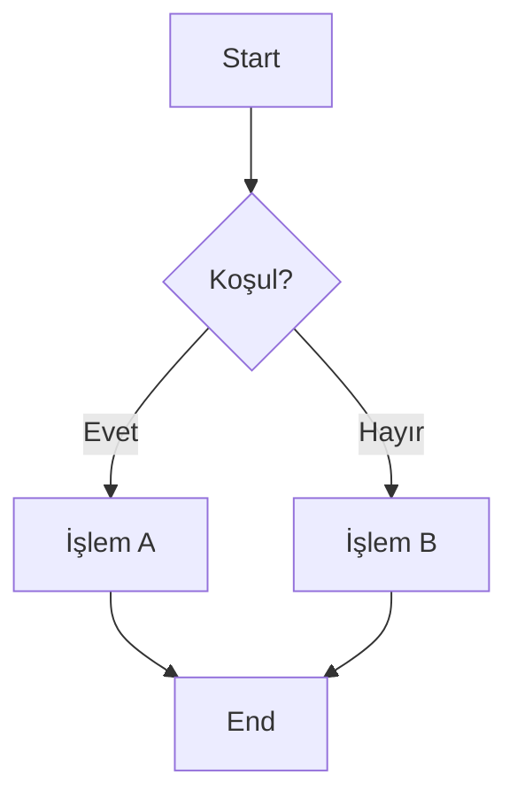

# Algoritma Nedir?

## Giriş: İşlem Yapmanın Felsefesi

Bilgisayarlar, sadece sayılar ve karakterleri işleyebilir. Bir işlem yapabilmek için, “bir şey yap” şeklinde karmaşık talimatlara ihtiyaç duyar. **Algoritma**, bu işlem yapma sürecinin en temel ve önemli yapı taşıdır.

> [!NOTE]
> Algoritma, bir yemek tarifine benzer: malzemeler (girdiler), adımlar (süreç) ve sonuç (çıktı) içerir.



---

## Algoritma Tanımı: Evrensel Bir Kavram

Algoritma, **belirli bir problemi çözmek için belirli bir sıralı adım dizisidir**. Her adım, önceki adımın sonucuna dayalı olarak yapılır ve sonunda kesin bir çıktı verir.

### Algoritmanın Beş Kritik Özelliği

| Özellik | Açıklama | Örnek |
|---------|----------|-------|
| **Giriş** | İşlem başlamadan önce alınan veriler | Diş fırçalama için su, macun |
| **Çıkış** | Algoritmanın sonunda ulaşılan sonuç | Temiz diş |
| **Belirli** | Her adım net ve tek yönlü ifade edilmelidir | “2 dakika fırçala” → “biraz fırçala” değil |
| **Sonlu** | Belli sayıda adım sonlanır, sonsuz döngü yoktur | Diş fırçalama 2 dakikada biter |
| **Etkili** | Her adım temel işlemlerle gerçekleştirilebilir | Her adım temel, uygulanabilir ve kağıt-kalemle bile yürütülebilecek basitlikte olmalıdır |

> [!TIP]
> İyi bir algoritma, her adımını kesin ve ölçülebilir kılar; belirsiz kalmaz.



---

## Algoritmanın Hayatımızda Herkese Açık Örnekleri

### 1. Kahve Yapım Algoritması

1. Kahve makinesine su ekleyin.  
2. Kavanozun içine kahve çekirdeği koyun.  
3. Kapağı kapatın.  
4. Brezilya Ayarı’nı seçin.  
5. “Start” tuşuna basın.  
6. Kavanozdan kahveyi çıkarın.  
7. **Eğer** şekerli isteniyorsa **şeker/şekerleme ekleyin**.  

> [!IMPORTANT]
> Her adım sıralı olmalı; örneğin kahveyi makineden almadan önce ekranı çalıştırmamalıyız.



### 2. YouTube’da Video Arama Algoritması

1. Tarayıcı açın.  
2. youtube.com adresine girin.  
3. Arama çubuğuna videonun adını yazın.  
4. “Enter” tuşuna basın.  
5. Listelenen videolar arasından istediğinizi seçin.  
6. Video oynatıcıyı başlatın.



### 3. Diyalog Kutusu Açma Algoritması (Telefon)

1. Telefon uçak modunu kapatın.  
2. Ana sayfaya dönün.  
3. “Telefon” uygulamasını açın.  
4. Aranacak kişiyi girin.  
5. “Ara” butonuna dokunun.  



---

## Neden Algoritma Çok Önemlidir? Üç Evrensel Soru

### Soru 1: “Bu İşlemi Kimse Yapmıyorsa Ne Yaparım?”

Algoritma, karşılaştığınız bir problemin **adım adım çözüm yolunu** oluşturur. Örneğin, “bir metnin içinde belirli bir kelimenin var olup olmadığını” nasıl bulursunuz?

#### Adım Adım Çözüm:
1. Metni oku.  
2. Kelimeyi baştan itibaren kontrol et.  
3. Eşleşirse, sonuç “var”.  
4. Hiç eşleşmezse, sonuç “yok”.

### Soru 2: “Bilgisayarı Etkin Kullanmak İçin Ne Gerekir?”

Bilgisayarlar sadece “ilk = 5, sonra = 3” gibi basit komutları işletir. **Algoritma**, bu basit komutları bir araya toplayıp karmaşık işlerde kullanmamızı sağlar.

> [!WARNING]
> Algoritmadan çok fazla adım çıkarmak, programı gereksiz yavaşlatır ve hata olasılığını artırır.



### Soru 3: “Farklı Şekillerde Aynı İşleti Yapabilir miyim?”

Evet! Aynı problem, farklı algoritmalarla çözülebilir. Örneğin, 100 sayı içinde en büyük sayıyı bulmak için:

- **Yöntem A**: Her sayıyı tek tek karşılaştır. (100 elemanda 100 karşılaştırma yapmak gibi)
- **Yöntem B**: Sayıları sırala, ilk elemanı al. (100 elemanda ~700 karşılaştırma yapmak gibi, sıralama maliyetiyle)
- **Yöntem C**: Sadece bir değişken tut, gezerken en büyüğü yakala. (100 elemanda 100 karşılaştırma yapmak gibi, ama sadece bir değişkenle)

Her yöntem farklıdır ama hepsi doğru sonucu verir.

> [!CAUTION]
> Yanlış algoritma seçimi, büyük veri kümelerinde performans sorunlarına yol açabilir (örnek: O(n²) yerine O(n log n) kullanılmalı).

---

## Algoritma Geliştirme Süreci

### Aşama 1: Problemi Tanımla

Öncelikle **tam olarak ne istendiğini** belirlemelisiniz:
- “Kullanıcı girişinde bir şifre kontrolü yap” yeterli mi?
- “Şifreyi bir kere kullanma sayısı kadar tut” gerekir mi?

> [!NOTE]
> Problemi net bir tanım koymak, gereksiz adımları önler.



### Aşama 2: Giriş ve Çıkışları Belirle

- **Giriş**: Algoritmaya ne kadar veri gerekir?
- **Çıkış**: Ne tür bir sonuç istersiniz?

| Sorunun Örneği | Giriş | Çıkış |
|----------------|-------|-------|
| Ortalama hesaplama | 3 sayı | Bu sayıların ortalaması |
| Sayı çift mi? | 1 tam sayı | “Evet” veya “Hayır” |
| Kitap arama | Kitap adı, yazar | Kitabın konumu |

> [!TIP]
> Girdi ve çıktıyı net tanımlamak, algoritmanın test edilmesini kolaylaştırır.

### Aşama 3: İçerdeki Mantığı Çöz

Bu aşamada, **çözüm için sıralanmamış adımlarla** başa çıkabilirsiniz. Genellikle “eğer…ise, o zaman…değilse…” yapıları kullanılır.

> [!IMPORTANT]
> Mantık adımlarını karıştırmadan önce tüm olası senaryoları yazın.



### Aşama 4: Sıralı Algoritma Oluştur

Algoritmanız bir satırda yazılmaz. Her adım **açık ve sıralı** olmalıdır.

#### Örnek: Sayının Çift Olup Olmadığını Kontrol Etme

```
Başla.
Sayı = 7
Eğer Sayı % 2 = 0 ise
    Yaz: "Çift sayıdır"
Değilse
    Yaz: "Tek sayıdır"
Bitir.
```

> [!TIP]
> Modulo operatörü (`%`) ile tek/çift kontrolü hızlı ve güvenilir bir yoldur.



---

## Algoritma Türleri

### 1. İşlevsel (Functional) Algoritmalar

Bir işin “nasıl yapılır” sorusuna odaklanır.  
**Örnek**: “Bir dizinin ortalamasını nasıl alırım?”

### 2. Karar Aracı (Decision-Based) Algoritmalar

Koşullara göre farklı sonuçlar verir.  
**Örnek**: “Hangi yolculuk ücreti daha uygun?”

> [!NOTE]
> Karar algoritmaları, genellikle elmas (rombüs) şeklinde gösterilir.



### 3. Tekrarlı (Iterative) Algoritmalar

Bir işlem belli kez veya koşul sağlandıkça tekrarlanır.  
**Örnek**: “Listedeki tüm öğrencilerin notlarını topla”

---

## Algoritma Çiziminde İpuçları

- **Belli adımlar kesinlikle izlenecek** bir şey olmalı.
- **“Ya da”, “ve”, “eğer” gibi kelimeler yerine “ise”, “diğer taktirde” gibi net ifadeler kullanın.
- Mümkünse **örneklem** ekleyin: “Örneğin, 24 yazdırın, sonra 18’i çıkarın.”

> [!TIP]
> Akış şeması çizerken her kutucuğa kısa ve anlamlı ifadeler yazın; okunabilirliği artar.

---

## Sık Karşılaşılan Hatalar ve Çözüm Yolları

| Hata | Neden | Çözüm |
|------|--------|--------|
| **Adım eksikliği** | Bir parça unutulmuş | Tüm adımlar bir kontrol listesinde |
| **Adım çelişkisi** | “Aynı anda iki iş yap” | Akış şeması çizerek kontrol et |
| **Adım kuvvetliliği** | “Biraz fazla” gibi belirsizlikler | Net sayılar veya ölçü birimleri |
| **Sonsuz döngü** | “Eğer koşul ise, ekle” ama hiç bitme şartı yok | Mutlaka bir “bitir” veya “dur” adımı |

> [!WARNING]
> Sonsuz döngü, programın donmasına ve kaynak tüketimine yol açar; her zaman bir çıkış koşulu olmalıdır.

---

## Alıştırmalar

Aşağıdaki alıştırmaları kendi başınıza çözün. Çözümünüzü **doğrudan yaz** ve ardından bir akış şeması çizin.

### Alıştırma 1: Kahvaltı Alarmı

Akşam yemek sonrası erken kalkmak için size kalan sürenin bir algoritması yazın. Giriş: kalan saat, dakika. Çıkış: “Alarm kaç’ta çalsın?”

### Alıştırma 2: Kitap Sayfası Sayma

Bir kitapta kaç sayfa olduğunu öğrenmek için izlemeniz gereken adımları sırasıyla yazın. Her sayfayı saymanız gerekiyor mu? Bir başlık ile neyi ararsınız?

### Alıştırma 3: E-posta Şifresi Güncelleme

E-posta hesabınıza giriş yapıp şifrenizi değiştirmek için adım adım bir yol haritası çıkarın. Aşağıdaki noktaları içermeli:
- Şifreniz nerede saklanır?  
- Hangi siteye giriş yapmalısınız?  
- Şifreyi ne zaman güncellemelisiniz?

> [!IMPORTANT]
> Şifre değiştirme sürecinde mevcut oturumlar dikkate alınmalı; kullanıcıya uygun bir zaman seçin.

---

## Özet

- **Algoritma**, problemi çözmek için sıralı bir talimattır.
- **5 temel özellik**: giriş, çıkış, belirli, sonlu, etkili.
- Günlük hayat tüm alışkanlıklarından daha karmaşık algoritmalar gerektirir.
- Doğru bir algoritma, hatasız sonuç verir; yanlış bir algoritma, hatanızı bile kendine öğretir.

> [!NOTE]
> Algoritma kavramını pekiştirmek için günlük yaşam üzerinden örnekler üretmeye devam edin.

Sonraki bölümde **“Akış Şemaları”** nasıl çizeriz, onu öğreneceğiz.