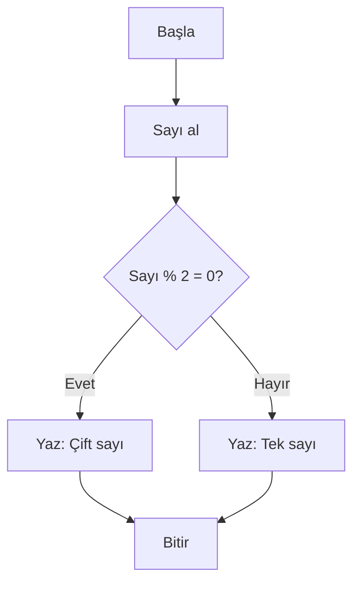

# Akış Şeması Nedir?

## Giriş: Programlama Sürecinde Görsel Akış Şeması

Bir algoritmayı sadece kelime ve cümlelerle tarif etmek, özellikle daha önce hiç programlama bilmeyen biri için yeterince açık olmayabilir. **Akış şeması (flowchart)**, bir sürecin her adımının görsel bir haritasıdır — oklar, kutular ve daireler kullanarak neyin, hangi sırayla ve nasıl yapıldığını gösterir.

> [!NOTE]
> Akış şeması, bir harita gibi çalışır: başlangıç noktasını gösterir, yolculuk boyunca yön verir ve varış noktasını işaret eder.

  
> (buraya örnek bir akış şeması görseli uygun olur)

---

## Akış Şemasının Ne İşe Yaradığını Anlamak: Bu Haritayı Neden Çizelim?

Bir programcıya görsel olarak anlatmak istediğinizde, her aşama için ekran görüntüsü çizmek yerine; sistemin nasıl çalıştığını özetleyen tek bir görsel harita bırakmak çok daha etkilidir.

### Akış Şemalarının Avantajları

- **Hızlı anlaşılma**: Gözün oklarla yön değiştirmesini takip etmek, uzun metinler okumaktan çok daha hızlıdır.
- **Hata yakalama**: Görselleştirme sırasında mantık hatalarını, kayıp adımları ve sonsuz döngüleri görmek çok daha kolaydır.
- **Paylaşım**: Başka bir programcının kodunu okumadan, ne yaptığını anlamasını sağlar.
- **Belgeleme**: Gelecekte projenize geri döndüğünüzde, akış şeması ne yaptığınızı hatırlatır.

> [!TIP]
> Akış şemasını çizmek, algoritmayı kodlamadan önce mantıksal hataları erken yakalamanın en etkili yollarından biridir.

  
> (buraya görsel akış şeması ve metin tabanlı not karşılaştırması görseli uygundur)

---

## Temel Akış Şeması Şekilleri

Her şekil belirli bir anlam taşır. Bu sembolleri bilmek, akış şeması çizerken size temel alfabeyi verir.

### 1. Başlangıç / Bitir Şekli

**Şekli**: Yuvarlatılmış kenarları olan dikdörtgen (oval).
**Kullanım Alanı**: Bir algoritmanın başladığı ve bittiği noktayı gösterir.

- İçine **Başla** (Start), **Başla**, **Giriş** (Input) veya **Bitir** (End), **Bitir**, **Çıkış** (Output) yazılır.
- Her akış şeması **tek bir Başla** ve **tek bir Bitir** ile başlamalı ve bitmelidir.

> [!IMPORTANT]
> Başlangıç ve bitiş şekilleri kesin olmalı; aksi takdirde akış şeması eksiksiz kalmaz.

  
> (buraya başlangıç ve bitir şekli görseli uygun olur)

### 2. İşlem Şekli

**Şekli**: Normal dikdörtgen.

**Kullanım Alanı**: Bir işlem veya eylemi temsil eder.

- Hesaplama: `Toplam = A + B`
- Değer atama: `KullanıcıAdı = "Ali"`
- Veri işleme: `Kod = Kod + 1`

  
> (buraya işlem şekli görseli uygundur)

### 3. Karar Şekli

**Şekli**: Elmas (rombüs) şekli.

- İçine **soru** yazılır: `Sayı < 0 mu?`
- Her çıkış yolu **Evet (E)** veya **Hayır (H)** ile etiketlenir.
- Karar şekilleri genellikle **iki** çıkışa sahiptir (Evet ve Hayır).

> [!WARNING]
> Karar şeklindeki soru net ve tek taraflı olmalı; belirsizlik bırakılmamalıdır.

  
> (buraya karar şekli görseli uygun olur)

### 4. Veri Şekli

**Şekli**: Paralel kenarlı dikdörtgen.

**Kullanım Alanı**: Giriş (input) veya çıktı (output) işlemlerini gösterir.

- **Giriş**: Klavyeden veri okuma, dosya okuma, kullanıcı girişi.
- **Çıktı**: Ekrana yazdırma, dosyaya yazma, yazdırma işlemleri.

  
> (buraya veri şekli görseli uygun olur)

### 5. Bağlantı Şekli

**Şekli**: Küçük yuvarlak.

**Kullanım Alanı**: Akış şemasının sayfalar arası veya sayfa içinde uzun olan bölümlerini bağlamak için kullanılır.

- İçine bir **harf** veya **numara** yazılır: `A`, `B`, `1`, `2`.
- Sayfa sonuna yaklaştığında bağlantı noktası kullanılır, devamı başka bir bağlantı noktasında devam eder.

> [!NOTE]
> Bağlantı şekilleri, özellikle uzun akış şemalarında sayfalar arasında akışı korumak için vazgeçilmezdir.

  
> (buraya bağlantı şekli görseli uygun olur)

### 6. Hazırlık / Döngü Şekli

**Şekli**: Paralel kenarlı dikdörtgen.

**Kullanım Alanı**: Bir döngünün başlatılmasını veya önceden tanımlı bir işlemin tekrarlanmasını gösterir.

- `i = 0` ile başlatma.
- `topla()` fonksiyonunu çağırma.

  
> (buraya hazırlık döngü şekli görseli uygun olur)

---

## Akış Şeması Çizim Kuralları

Bir akış şeması çizerken uyulması gereken kurallar, okunabilirliği ve doğruluğu garanti eder.

### Temel Kurallar

1. **Yukarıdan aşağıya, soldan sağa**: Akış genel olarak yukarıdan aşağıya doğru ilerlemelidir.
2. **Oklar mutlaka çizilmelidir**: Her iki şekil arasındaki bağlantı ok ile gösterilmelidir (bağlantı noktası hariç).
3. **Döngüler kapalı olmalıdır**: Her döngü, başladığı noktaya geri dönen bir ok ile tamamlanmalıdır.
4. **Tüm dallar sonlanır**: Karar şekillerinin her çıkış yolu (Evet ve Hayır) bir yere bağlanmalıdır; "havada kalan" ok bulunmamalıdır.
5. **Tek bir başlangıç noktası**: Akış şeması bir noktadan başlamalıdır.

> [!IMPORTANT]
> Bu kurallar izlenmezse akış şeması anlam kaybeder ve yanlış yorumlanabilir.

  
> (buraya akış şeması çizim kuralları görseli uygundur)

### Dikkat Edilmesi Gereken İpuçları

- Her şekil içine kısa, net ifadeler yazın.
- Ok yönlerini belirten **Evet/Hayır** etiketlerini unutmayın.
- Karmaşık süreçlerde sayfaları bölüp bağlantı noktaları kullanın.
- Renk kullanımından kaçının; monokromatik çizimler daha kolay yazdırılır ve okunur.

---

## Basit Bir Örnek: Sayının Çift mi Tek mi Olduğunu Kontrol Etme

Aşağıdaki adımları akış şeması olarak çizelim:

1. **Başla**
2. Kullanıcıdan bir sayı al
3. Sayıyı 2'ye böl ve kalanı kontrol et
4. Eğer kalan 0 ise → "Çift sayı"
5. Aksi halde → "Tek sayı"
6. Sonucu ekrana yaz
7. **Bitir**

> [!TIP]
> Bu örnek, karar yapısının akış şemasında nasıl kullanıldığını gösterir.

  
> (buraya çift-tek kontrolünün akış şeması görseli uygun olur)

---

## Alıştırmalar

Aşağıdaki alıştırmaları kendi başınıza çözün. Her birini önce bir algoritma olarak yazın, sonra akış şeması olarak çizin.

### Alıştırma 1: İki Sayının Toplamını Hesaplama

Kullanıcıdan iki sayı alın, toplan ve sonucu ekrana yazdırın.

### Alıştırma 2: Sayının Pozitif mi Negatif mi Olduğunu Kontrol Etme

Kullanıcıdan bir sayı alın. Sayı 0'dan büyükse "Pozitif", 0'dan küçükse "Negatif", tam olarak 0 ise "Sıfır" yazdırın.

### Alıştırma 3: Notun Geçme mi Geçmemiş mi Olduğunu Kontrol Etme

Kullanıcıdan 0-100 arası bir not alın. Not 50 ve üzeri ise "Başarılı", altı ise "Başarısız" yazdırın.

> [!IMPORTANT]
> Her alıştırma için önce algoritmayı yazın, ardından akış şeması çizin; ikisini birleştirerek öğrenmeyi pekiştirin.

  
> (buraya alıştırmaların görsel örneği görseli uygun olur)

---

## Özet

- **Akış şeması (flowchart)**, bir sürecin adım adım görsel haritasıdır.
- **Ana şekiller**: Başlangıç/Bitir, İşlem, Karar, Veri, Bağlantı, Hazırlık.
- Her karar şekli **Evet** ve **Hayır** yollarıyla sonlandırılmalıdır.
- Akış şeması **yatay ve dikey oklar** ile okunabilirliği sağlar.
- Algoritmadan koda geçişte köprü görevi görür.

> [!NOTE]
> Akış şeması becerisi, karar yapıları ve döngüler konusuna geçmeden önce önceden kazanılmalıdır.

Sonraki bölümde **Değişkenler, Sabitler ve Veri Tipleri** konusuna geçeceğiz.