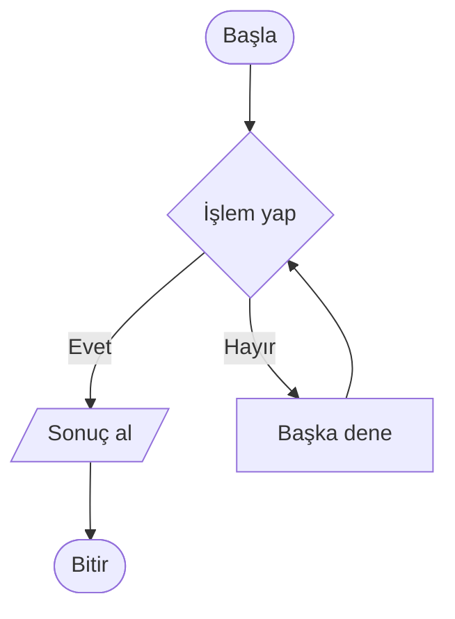
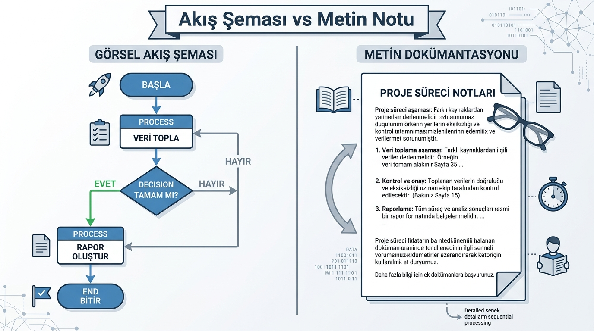
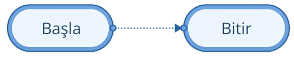
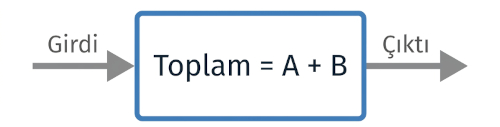
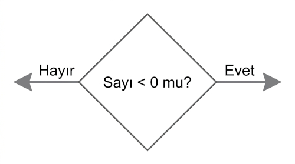
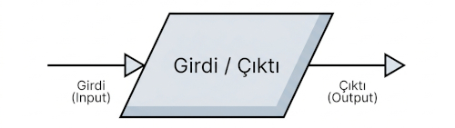
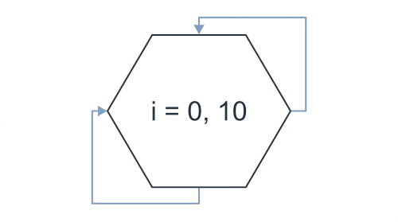
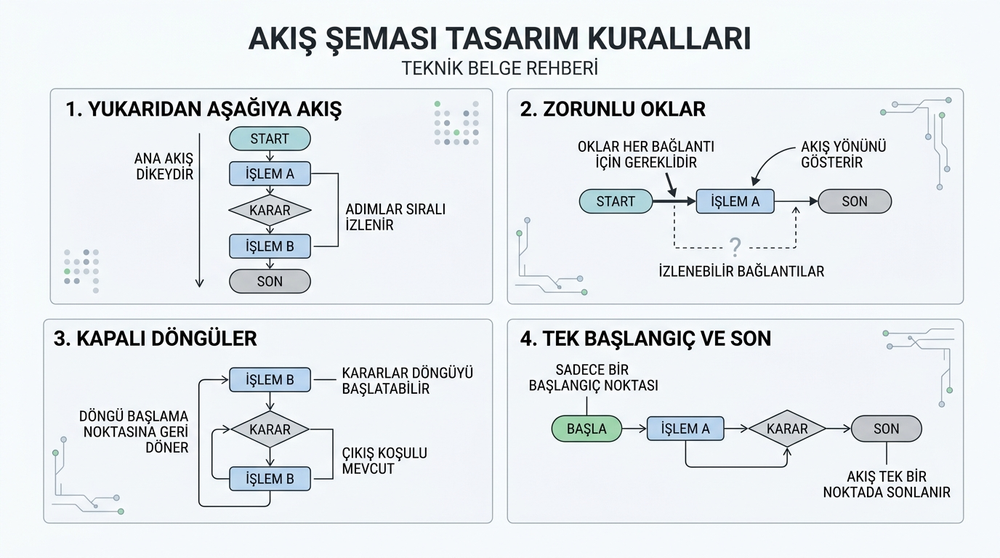
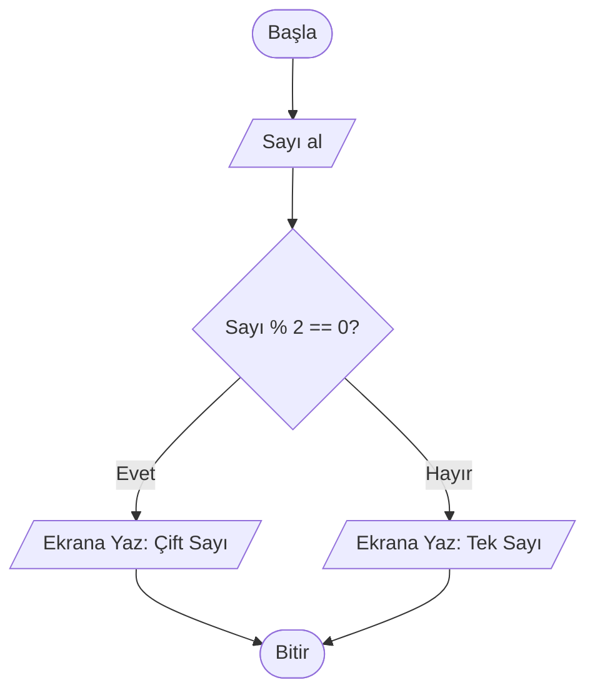
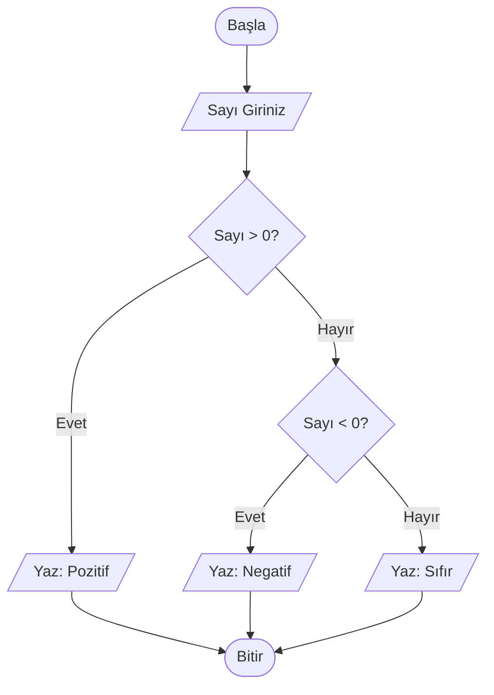

# Akış Şeması Nedir?

## Giriş: Programlama Sürecinde Görsel Akış Şeması

Bir algoritmayı sadece kelime ve cümlelerle tarif etmek, özellikle daha önce hiç programlama deneyimi olmayan biri için yeterince açık olmayabilir. **Akış şeması (flowchart)**, bir sürecin her adımının görsel bir haritasıdır. Oklar, kutular ve geometrik şekiller kullanarak neyin, hangi sırayla ve nasıl yapıldığını adım adım gösterir.

> [!NOTE]
> Akış şeması, tıpkı bir yol haritası gibi çalışır: başlangıç noktasını gösterir, yolculuk boyunca yön verir ve varış noktasını işaret eder.

---

## Akış Şemalarının Önemi ve Avantajları

Bir algoritmayı görsel olarak temsil etmek, karmaşık sistemlerin anlaşılmasını kolaylaştırır ve geliştirme sürecini hızlandırır.

### Hızlı Özet: Temel Şekiller Referans Tablosu

| Sembol / Şekil | Şekil Adı | İşlevi / Kullanım Alanı |
| :--- | :--- | :--- | 
| **Oval / Yuvarlatılmış Kutucuk** | Başlangıç / Bitiş | Algoritmanın başladığı veya bittiği nokta | 
| **Dikdörtgen** | İşlem (Process) | Hesaplama, atama ve veri işleme adımları | 
| **Eşkenar Dörtgen (Elmas)** | Karar (Decision) | Koşullu dallanma ve mantıksal kontrol | 
| **Paralelkenar** | Veri / Girdi-Çıktı (I/O) | Kullanıcıdan veri alma veya ekrana yazdırma |
| **Küçük Daire** | Bağlantı (Connector) | Farklı akış yollarını birleştirme / Sayfa geçişleri | 
| **Düzgün Altıgen** | Hazırlık / Döngü (Loop) | Döngü değişkeni tanımlama ve yineleme |

### Akış Şemalarının Avantajları

- **Hızlı Anlaşılma**: Görsel akışı ve okları takip etmek, uzun paragraflar okumaktan çok daha hızlı ve etkilidir.
- **Mantık Hatalarını Yakalama**: Görselleştirme sayesinde eksik adımlar, hatalı yönlendirmeler ve sonsuz döngüler kolayca fark edilir.
- **Ekip İçi İletişim ve Paylaşım**: Yazılım ekibindeki diğer kişilerin koda boğulmadan algoritmanın özünü anlamasını sağlar.
- **Etkili Belgeleme**: Gelecekte projeye geri dönüldüğünde veya yeni bir geliştirici dahil olduğunda kılavuz görevi görür.

> [!TIP]
> Akış şemasını çizmek, algoritmayı kodlamaya geçmeden önce mantıksal hataları tespit etmenin en pratik yoludur.

---

## Temel Akış Şeması Şekilleri ve Anlamları

Her şekil belirli bir standart anlam taşır. Bu semboller, akış şeması çizerken kullanacağınız temel alfabeyi oluşturur.

### 1. Başlangıç / Bitiş Şekli (Terminal)

**Şekli**: Yuvarlatılmış kenarları olan dikdörtgen veya oval.  
**Kullanım Alanı**: Bir algoritmanın başladığı ve sonlandığı noktaları gösterir.

- İçine **Başla** (Start) veya **Bitir** (End/Stop) yazılır.
- Her akış şeması kesinlikle **tek bir Başla** adımı ile başlamalı ve **en az bir Bitir** adımı ile sonlanmalıdır.

> [!IMPORTANT]
> Başlangıç ve bitiş noktaları net olmayan bir akış şeması eksik kabul edilir.

  

### 2. İşlem Şekli (Process)

**Şekli**: Dikdörtgen.  
**Kullanım Alanı**: Matematiksel hesaplamalar, değer atamaları veya veri dönüştürme adımlarını temsil eder.

- Hesaplama: `Toplam = A + B`
- Değer atama: `KullanıcıAdı = "Ali"`
- Sayaç güncelleme: `Sayaç = Sayaç + 1`

  

### 3. Karar Şekli (Decision)

**Şekli**: Eşkenar dörtgen (Elmas / Rombüs).  
**Kullanım Alanı**: Bir koşulun sonucuna göre (Doğru/Yanlış) akışın farklı yollara sapmasını sağlar.

- İçine net bir **soru veya koşul** yazılır: `Sayı < 0 mı?`
- Her çıkış yolu **Evet (E) / Hayır (H)** veya **Doğru (D) / Yanlış (Y)** şeklinde etiketlenir.
- Karar şekilleri genel olarak **iki** farklı çıkış yoluna sahiptir.

> [!WARNING]
> Karar sembolü içindeki soru net olmalı; muğlak veya iki anlamlı ifadeler kullanılmamalıdır.

### 4. Veri / Girdi-Çıktı Şekli (Input / Output)

**Şekli**: Paralelkenar.  
**Kullanım Alanı**: Dış dünyadan veri alma (Girdi) veya dış dünyaya veri aktarma (Çıktı) işlemlerini gösterir.

- **Girdi**: Klavyeden değer okuma, dosyadan veri alma, kullanıcı girişi.
- **Çıktı**: Ekrana sonuç yazdırma, dosyaya kaydetme veya yazıcıya gönderme.

 

### 5. Bağlantı Şekli (Connector)

**Şekli**: Küçük daire.  
**Kullanım Alanı**: Sayfa içine dağılmış karmaşık akış hatlarını birleştirmek veya sayfalar arası geçişleri sağlamak için kullanılır.

- İçine yönlendirici bir **harf** veya **sayı** yazılır: `A`, `B`, `1`, `2`.
- Akış çizgisinin karmaşıklaşmasını önler ve okunabilirliği artırır.

> [!NOTE]
> Bağlantı elemanları, karmaşık ve çok sayfalı akış şemalarında düzeni korumak için hayati önem taşır.

  

### 6. Hazırlık / Döngü Şekli (Preparation / Loop)

**Şekli**: Düzgün altıgen.  
**Kullanım Alanı**: Sayaçların başlatılması, döngü koşullarının ve adım miktarlarının önceden belirlenmesi için kullanılır.

- Değişken başlatma: `i = 1 to N`
- Belirli sayıda tekrarlanacak işlemleri kontrol etme.

  

---

## Akış Şeması Çizim Kuralları

Standartlara uygun bir akış şeması çizmek, algoritmanın herkes tarafından aynı şekilde anlaşılmasını sağlar.

### Temel Kurallar

1. **Yön Standardı (Yukarıdan Aşağıya, Soldan Sağa)**: Akış çizgileri genel olarak yukarıdan aşağıya ve soldan sağa doğru ilerlemelidir.
2. **Bağlantı Okları**: Şekiller arasındaki ilişki ve yön mutlaka ok başları ile gösterilmelidir.
3. **Kapalı Döngüler**: Bir döngü yapısı var ise, tekrarlayan akış çizgisi döngü başlangıcına açıkça geri dönmelidir.
4. **Boşta Kalan Yol Olmamalıdır**: Karar yapılarından çıkan tüm dallar (Evet/Hayır) mutlaka bir sonraki adımla veya bitişle birleştirilmelidir.
5. **Tek Başlangıç Noktası**: Her akış şemasında yalnızca bir adet "Başla" sembolü bulunmalıdır.

> [!IMPORTANT]
> Bu kurallara uyulmaması akış şemasının yanlış yorumlanmasına ve kodlama aşamasında mantık hatalarına yol açar.

  

### Okunabilirliği Artıran İpuçları

- Şekillerin içerisine kısa, net ve anlaşılır ifadeler yazın.
- Karar yapılarındaki çıkış oklarına **Evet/Hayır** etiketlerini eklemeyi unutmayın.
- Çizgilerin birbiriyle çakışmasını önlemek için bağlantı noktaları kullanın.
- Doküman çıktıları düşünülerek renkli çizimler yerine net konturlu monokromatik tasarımları tercih edebilirsiniz.

---

## Uygulama Örneği: Sayının Çift mi Tek mi Olduğunun Kontrolü

Bir kullanıcının girdiği sayının çift veya tek olduğunu tespit eden akış şeması adımları şu şekildedir:

1. **Başla**
2. Kullanıcıdan bir sayı al (`Sayı`)
3. Sayının 2'ye bölümünden kalanı hesapla (`Kalan = Sayı % 2`)
4. **Kalan == 0** mı kontrol et:
   - **Evet** ise → Ekrana "Çift Sayı" yazdır.
   - **Hayır** ise → Ekrana "Tek Sayı" yazdır.
5. **Bitir**

---

## Alıştırmalar

Aşağıdaki alıştırmaları inceleyerek kendi akış şemalarınızı oluşturun. Önce adım adım algoritmasını metin olarak yazın, ardından şemasını çizin.

### Alıştırma 1: İki Sayının Toplamını Hesaplama
Kullanıcıdan iki sayı alın, bu sayıları toplayın ve sonucu ekrana yazdırın.

### Alıştırma 2: Sayının Pozitif, Negatif veya Sıfır Olduğunu Kontrol Etme
Kullanıcıdan bir sayı alın. Sayı 0'dan büyükse "Pozitif", 0'dan küçükse "Negatif", 0'a eşitse "Sıfır" mesajı verin.

### Alıştırma 3: Notun Geçme / Kalma Durumunu Kontrol Etme
Kullanıcıdan 0–100 arası bir ders notu alın. Not 50 ve üzerinde ise "Başarılı", 50'nin altında ise "Başarısız" sonucunu ekrana yazdırın.

> [!IMPORTANT]
> Pratik yaparken önce algoritmik mantığı kurmak, ardından bunu akış şeması sembollerine dökmek öğrenme sürecini hızlandıracaktır.

---

## Özet

- **Akış şeması (flowchart)**, bir algoritmanın adım adım görselleştirilmiş haritasıdır.
- **Temel Elemanlar**: Başla/Bitir (Oval), İşlem (Dikdörtgen), Karar (Elmas), Veri (Paralelkenar), Bağlantı (Daire), Döngü (Altıgen).
- Karar yapılarında tüm olası çıkış yolları (**Evet/Hayır**) açıkça belirtilmelidir.
- Standart yönler ve oklar mantıksal takibi kolaylaştırır.
- Akış şeması, algoritma tasarımından kod yazımına geçişte en önemli köprüdür.