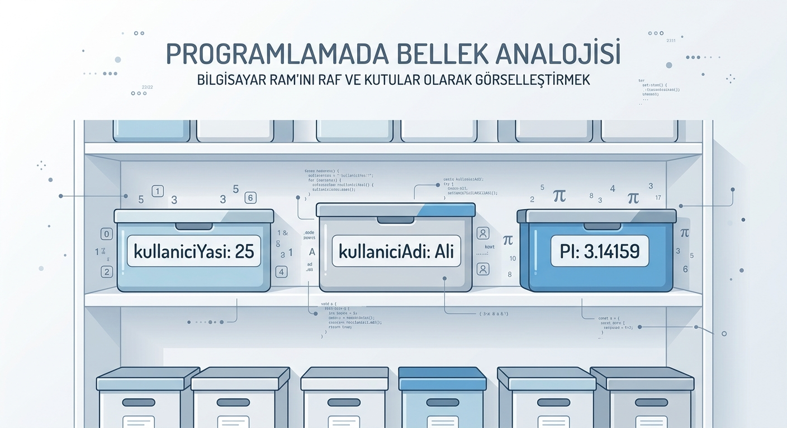
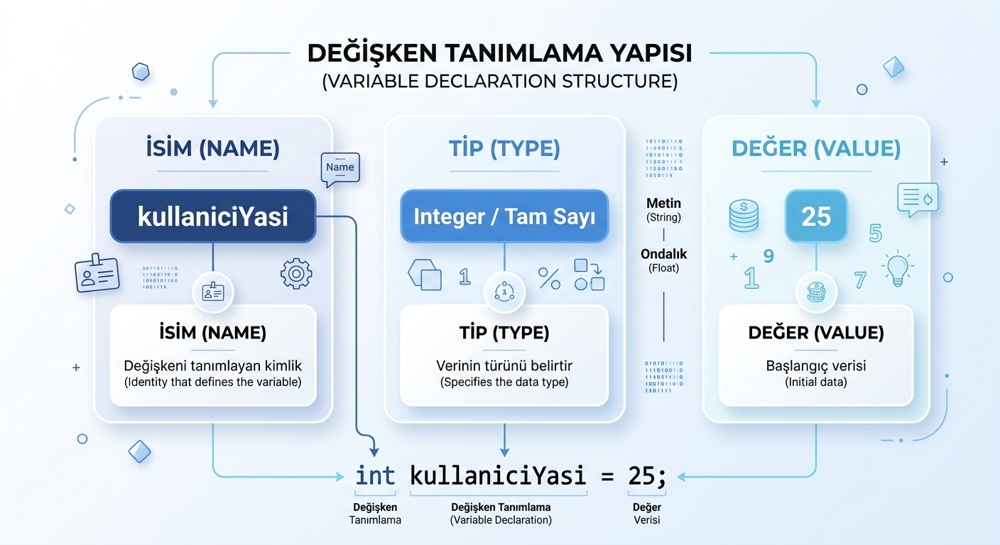
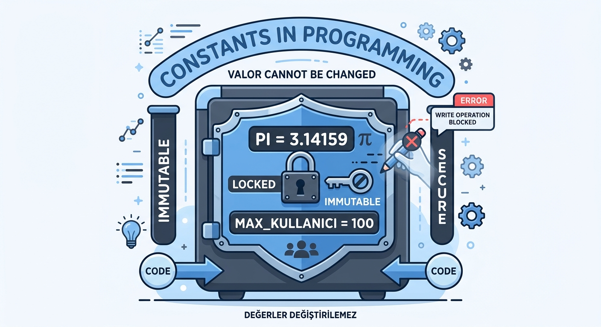
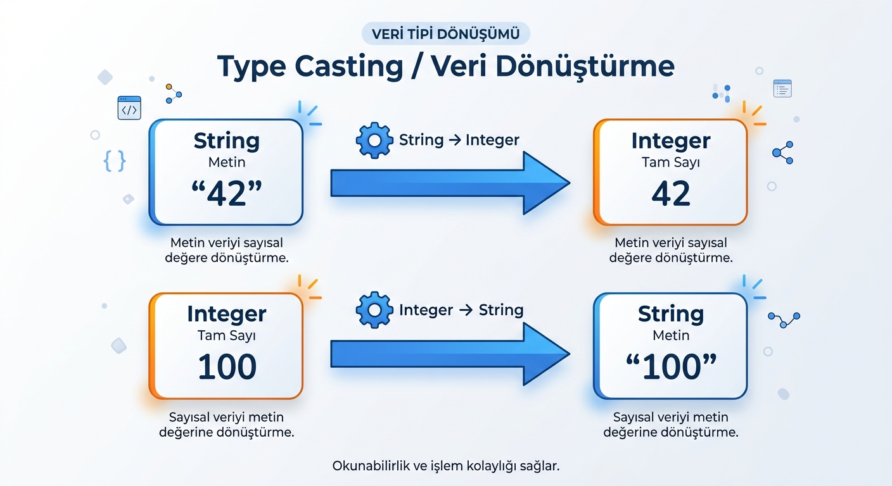
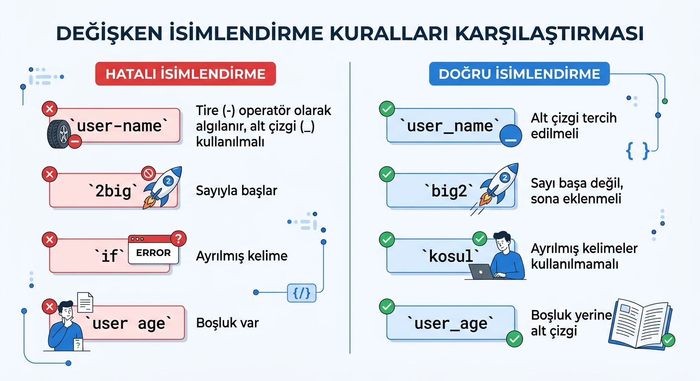
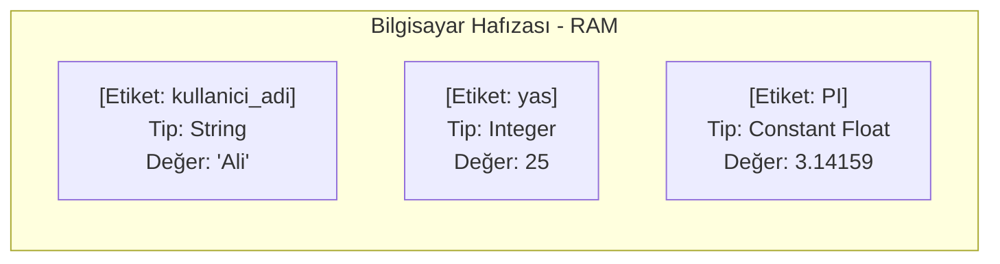

# Değişkenler, Sabitler ve Veri Tipleri

## Giriş: Bilgisayarın Belleği

Bilgisayarlar, işledikleri tüm verileri geçici hafızalarında (RAM) saklar. Bu veriler, her birinin kendine has bir "adı" ve "tipi" ile birlikte depolanır. **Değişken**, bilgisayarın verisini saklamak ve daha sonra kullanmak üzere bellekte ayrılan adlandırılmış bir konumdur. **Veri tipi**, bu konumda ne tür bir bilginin tutulduğunu belirler. **Sabit** ise tanımlandıktan sonra değeri program boyunca değiştirilemeyen özel bir konsepttir.

> [!NOTE]
> Bilgisayar belleği, raflar ve kutulardan oluşan bir depolama alanı gibi düşünülebilir: Her kutunun bir etiketi (değişken adı) ve içine konulabilecek ürün türü (veri tipi) vardır.



---

## Değişken Nedir ve Nasıl Kullanılır?

Bir **değişken**, verileri saklamak için kullanılan adlandırılmış bir "bellek kutusudur". Değişken tanımlandığında, bilgisayar o verinin türüne uygun boyutta bir bellek bölgesini tahsis eder. Programın ilerleyen adımlarında değişkenin ismini çağırarak bu değeri okuyabilir veya güncelleyebilirsiniz.

### Değişken Nasıl Tanımlanır?

Genellikle bir değişken tanımlanırken **Tip + İsim + Değer** bileşenleri kullanılır.

| Bileşen | Açıklama | Örnek |
| :--- | :--- | :--- |
| **İsim** | Değişkeni bellekte temsil eden ve ona erişmemizi sağlayan kimlik. | `kullaniciYasi` |
| **Tip** | Saklanacak verinin türünü belirten etiket (tam sayı, metin vb.). | `Integer` |
| **Değer** | Değişkene atanan başlangıç verisi. (Belirtilmezse öntanımlı değer atanabilir). | `25` |

> [!TIP]
> Değişken isimleri işlevi net bir şekilde ifade etmelidir: `x` yerine `kullaniciYasi`, `s` yerine `toplam` gibi isimler tercih edilmelidir.



### Değişken Tanımlama Örnekleri

**Örnek 1: Yaş Değişkeni**
```text
Değişken Adı: kullaniciYasi
Veri Tipi   : Tam Sayı (Integer)
Değer       : 25
```

**Örnek 2: Kullanıcı Adı Değişkeni**
```text
Değişken Adı: kullaniciAdi
Veri Tipi   : Metin (String)
Değer       : "Ali"
```

> [!IMPORTANT]
> Değişken isimlerinde boşluk bırakılamaz ve özel karakterler (tire, soru işareti vb.) kullanılamaz; kelimeleri ayırmak için alt çizgi (`_`) veya büyük harf tercih edilmelidir.

---

## Temel Veri Tipleri

Programlama dillerinin birçoğunda verileri kategorize etmek için standart temel veri tipleri yer alır. Bunlar bellekte kapladıkları alan ve sundukları yetenekler bakımından farklılık gösterir.

### 1. Tam Sayı (Integer)

- **Açıklama**: Ondalık kısmı olmayan tam sayılardır. Pozitif, negatif veya sıfır değerini alabilir.
- **Örnek**: `-3`, `0`, `7`, `42`
- **Kullanım Alanı**: Sayaçlar, döngü indeksleri, yaş bilgisi, adet miktarları.
- **Bellek Boyutu**: Genellikle 4 byte (32-bit) veya 8 byte (64-bit).

### 2. Ondalıklı Sayı (Float / Double)

- **Açıklama**: Kesirli ve ondalıklı sayılardır. Hassas matematiksel hesaplamalarda kullanılır.
- **Örnek**: `3.14`, `-0.5`, `2.0`, `100.75`
- **Kullanım Alanı**: Fiyat hesaplamaları, ölçümler, bilimsel veriler, koordinatlar.
- **Bellek Boyutu**: `Float` genellikle 4 byte (32-bit), `Double` ise 8 byte (64-bit) alan kaplar.

> [!TIP]
> Yüksek hassasiyet gerektiren finansal ve bilimsel işlemlerde `Double` tercih edilir.

### 3. Metin (String)

- **Açıklama**: Karakter dizileridir. Harf, rakam ve sembollerden oluşan metinleri temsil eder. Çift tırnak (`"..."`) veya tek tırnak (`'...'`) içinde yazılır.
- **Örnek**: `"Merhaba"`, `'Ahmet'`, `"12345"`
- **Kullanım Alanı**: Kullanıcı adları, e-posta adresleri, mesajlar, adres bilgileri.
- **Bellek Boyutu**: Metnin uzunluğuna göre dinamik olarak değişir.

> [!NOTE]
> Metinler içinde satır başı yapmak için `\n`, bir tab boşluk bırakmak için `\t` gibi kaçış karakterleri (escape characters) kullanılır.

### 4. Mantıksal (Boolean)

- **Açıklama**: Sadece iki olası değer taşıyabilen mantıksal veri tipidir: **Doğru (True)** veya **Yanlış (False)**.
- **Örnek**: `true`, `false`
- **Kullanım Alanı**: Koşul kontrolleri (`if`), döngü durumları, durum bayrakları (örn: `isLoggedIn`).
- **Bellek Boyutu**: Genellikle 1 byte.

> [!CAUTION]
> Bazı dillerde `0` değeri `false`, `0` dışındaki sayılar `true` kabul edilebilir. Ancak kod okunabilirliği için açıkça `true`/`false` kullanılmalıdır.

---

## Sabitler (Constants)

Bir **sabit**, ilk değer ataması yapıldıktan sonra programın çalışması boyunca değeri değiştirilemeyen yapılardır.

### Neden Sabit Kullanılır?

- **Okunabilirlik ve Anlaşılabilirlik**: Sihirli sayıların (`magic numbers`) ne anlama geldiğini netleştirir.
- **Güvenlik**: Yanlışlıkla değiştirilmemesi gereken kritik değerleri korur.
- **Kolay Bakım**: Değer değiştiğinde tek bir noktadan güncelleme yapılması yeterlidir.

| Sabit Adı | Değer | Açıklama |
| :--- | :--- | :--- |
| `PI` | `3.14159` | Daire alanı/çevresi hesaplamalarında kullanılan oran |
| `MAX_KULLANICI` | `100` | Sisteme aynı anda bağlanabilecek maksimum kullanıcı sayısı |
| `HOŞGELDİN_MESAJI` | `"Hoş geldiniz!"` | Sabit arayüz karşılama metni |
| `KDV_ORANI` | `0.20` | Güncel %20 KDV oranı |

> [!TIP]
> Değişkenlerden kolayca ayırt edilebilmeleri için sabit isimleri genellikle **TÜMÜ BÜYÜK HARFLERLE** yazılır (örn: `MAX_RETRY_COUNT`).



---

## Veri Dönüşümleri (Type Casting)

Farklı veri tipleri arasında işlem yapabilmek veya uyumluluk sağlamak amacıyla bir veri tipini başka bir veri tipine dönüştürme işlemidir.

### Dönüşüm Gerektiren Durumlar

| Durum | Açıklama | Örnek |
| :--- | :--- | :--- |
| **Sayıyı Metne Çevirme** | Sayısal bir hesaplama sonucunu ekranda bir metinle birleştirip göstermek. | `42` -> `"42"` |
| **Metni Sayıya Çevirme** | Ekrana veya metoda metin olarak girilen bir rakamı hesaplamada kullanmak. | `"100"` -> `100` |
| **Tip Uyumsuzluğunu Giderme** | `Float` ve `Integer` değerleri bir arada işlemek. | `5.7` -> `5` |

### Örnek Dönüşüm Adımları

**Sayıyı Metne Dönüştürme:**
```text
Sayı Değişkeni   : yas = 25 (Integer)
Dönüştürme İşlemi: metinYas = str(yas)
Yeni Değer       : "25" (String)
```

**Metni Sayıya Dönüştürme:**
```text
Metin Değişkeni  : girilenFiyat = "150" (String)
Dönüştürme İşlemi: fiyat = int(girilenFiyat)
Yeni Değer       : 150 (Integer)
```

> [!WARNING]
> Metinden sayıya dönüşüm yaparken metnin geçerli bir sayı içermesi gerekir (örn: `"abc"` metni sayıya dönüştürülemez ve program hatası oluşturur).



---

## Değişken İsimlendirme Kuralları ve Standartları

Değişken tanımlarken yazım kurallarına ve genel kabul görmüş standartlara uymak gerekir.

### Zorunlu Kurallar
1. **Sayı ile Başlayamaz**: `1sayi` geçersizdir; `sayi1` kullanılabilir.
2. **Boşluk ve Özel Karakter İçeremez**: Değişken isimlerinde yalnızca harfler, sayılar ve alt çizgi (`_`) bulunabilir.
3. **Ayrılmış Kelimeler Kullanılamaz**: Dillerin kendi anahtar kelimeleri (`if`, `for`, `class`, `return` vb.) değişken adı yapılamaz.

### Yaygın İsimlendirme Standartları

| Standart | Biçim | Örnek | Yaygın Kullanıldığı Alanlar |
| :--- | :--- | :--- | :--- |
| **camelCase** | İlk kelime küçük, sonraki kelimelerin ilk harfi büyük. | `kullaniciAdi` | Java, JavaScript, C# |
| **snake_case** | Kelimeler küçük harfle yazılır ve alt çizgi ile ayrılır. | `kullanici_adi` | Python, SQL |
| **PascalCase** | Her kelimenin ilk harfi büyük yazılır. | `KullaniciAdi` | Sınıf (Class) İsimleri |

> [!NOTE]
> Çoğu programlama dili büyük/küçük harfe duyarlıdır (Case-sensitive): `yas` ile `Yas` iki farklı değişkendir.



---

## Örnek Uygulama: Kullanıcı Bilgisi İşleme

Aşağıdaki sahte kod (pseudo-code) örneğinde değişken tanımlama, tip dönüşümü ve ekrana yazdırma işlemleri bir arada sunulmuştur.

```text
# Değişkenlerin tanımlanması
TANIMLA kullanici_adi : Metin = "Ali"
TANIMLA yas : Tam Sayı = 25
TANIMLA yeni_yas : Tam Sayı

# Yaş bilgisi üzerinde işlem yapılması
yeni_yas = yas + 10

# Sonuçların ekrana yazdırılması (Metin birleştirme için tip dönüşümü yapılır)
YAZDIR "Kullanıcı Adı: " + kullanici_adi
YAZDIR "Mevcut Yaş: " + str(yas)
YAZDIR "10 Yıl Sonraki Yaş: " + str(yeni_yas)
```



---

## Alıştırmalar

Aşağıdaki problemleri sahte kod (pseudo-code) veya tercih ettiğiniz bir programlama dilinde çözünüz.

### Alıştırma 1: Üçgenin Alanı
Kullanıcıdan taban uzunluğu ve yüksekliği alan, ardından üçgenin alanını ($\text{Alan} = \frac{\text{Taban} \times \text{Yükseklik}}{2}$) hesaplayıp ekrana yazdıran programı yazınız. *(Uygun veri tiplerini seçmeyi unutmayın.)*

### Alıştırma 2: Sayı Toplama ve Tür Kontrolü
Kullanıcıdan iki tam sayı alın. Toplamlarını hesaplayın. Toplam sonucunun çift mi yoksa tek mi olduğunu kontrol ederek ekrana yazdırın.

### Alıştırma 3: Başarı Durum Kontrolü
Kullanıcıdan 0–100 arasında bir sınav notu alın. Notun 50 veya daha büyük olması durumunu kontrol eden `isPassed` adında **Boolean** bir değişken tanımlayın. Sonucu bu değişkene göre "Başarılı" veya "Başarısız" olarak ekrana yazdırın.

> [!IMPORTANT]
> Alıştırmaları çözerken önce kullanacağınız değişkenleri ve tiplerini belirlemeyi alışkanlık haline getirin.

---

## Özet

- **Değişken**, verileri bellekte tutan ve adlandırılan saklama alanıdır.
- **Veri tipi**, değişkende tutulan verinin niteliğini ve sınırlarını belirler.
- **Temel Veri Tipi Türleri**: `Integer` (Tam Sayı), `Float/Double` (Ondalıklı Sayı), `String` (Metin), `Boolean` (Mantıksal).
- **Sabitler (Constants)**, program çalışırken değeri değiştirilemeyen güvenli yapılardır.
- **Veri Dönüşümü (Casting)**, uyumluluk sağlamak için veri tiplerinin birbirine dönüştürülmesidir (`str()`, `int()`).
- Değişken isimleri net olmalı; sayı ile başlamamalı, boşluk barındırmamalı ve seçilen dilin standartlarına (`camelCase`, `snake_case`) uygun yazılmalıdır.